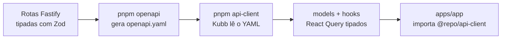

# Boilerplate Monorepo (SaaS)

[](https://github.com/rodrigocgodoy/boilerplate-monorepo/actions/workflows/ci.yml)


Ponto de partida enxuto para SaaS em TypeScript: autenticação pronta, contrato tipado de ponta a ponta gerado a partir do OpenAPI, banco com Prisma e UI com tokens fáceis de customizar.

O objetivo não é ser um framework, e sim eliminar a semana que se perde em todo projeto novo configurando as mesmas cinco coisas.

---

## O problema que este boilerplate resolve

Todo SaaS começa igual: configurar workspace, subir autenticação, definir o contrato entre API e frontend, montar o design system e decidir como o time vai rodar tudo localmente. Esse trabalho não diferencia produto nenhum, mas custa dias — e, quando é feito às pressas, vira dívida técnica antes do primeiro deploy.

O ponto central aqui é o **contrato tipado automático**. A API é a fonte da verdade: rotas tipadas com Zod geram o `openapi.yaml`, e o Kubb gera os hooks React Query a partir desse arquivo. O frontend não escreve client HTTP, não declara tipo de resposta e não descobre em produção que um campo mudou de nome. Se o contrato quebra, quebra no build.

---

## Decisões arquiteturais

Por que cada peça está aqui, e o que foi descartado no caminho.

| Decisão | Alternativas consideradas | Motivo |
|---|---|---|
| **Monorepo com Turborepo + pnpm workspaces** | Repositórios separados, Nx | Contrato entre API e frontend precisa viver no mesmo commit. Repositórios separados transformam mudança de campo em coordenação de dois pull requests. Turborepo entrega cache e pipeline sem o peso de configuração do Nx. |
| **Fastify** | Express, NestJS | Validação e serialização por schema nativas, integração direta com Zod via `fastify-type-provider-zod` e geração de OpenAPI sem camada extra. NestJS traz estrutura que só compensa em time grande. |
| **Contrato gerado (Zod → OpenAPI → Kubb)** | Client HTTP manual, tRPC | Client escrito à mão desatualiza silenciosamente. tRPC acopla frontend e backend ao mesmo runtime TypeScript, inviabilizando consumidores externos; OpenAPI mantém a API aberta a qualquer cliente. |
| **Better Auth** | Auth.js, Clerk, autenticação própria | Controle total do banco e das sessões, sem custo por usuário e sem dependência de serviço externo. Autenticação própria é o tipo de código que parece simples e envelhece mal. |
| **Prisma + adapter-pg** | Drizzle, SQL puro | Migrations e tipagem confiáveis com curva de entrada baixa para quem entra no projeto. O schema começa com o mínimo (modelos do Better Auth) para não impor modelagem de domínio. |
| **Biome** | ESLint + Prettier | Uma ferramenta, um arquivo de configuração e execução significativamente mais rápida no lugar de dois ecossistemas de plugins que conflitam entre si. |
| **shadcn/ui com tokens OKLCH** | Biblioteca de componentes pronta | Componentes ficam no repositório, não em `node_modules` — dá para editar sem lutar contra a API de terceiro. OKLCH mantém contraste perceptualmente consistente ao trocar a paleta. |
| **i18n desde o início** | Adicionar quando precisar | Internacionalizar depois significa varrer strings em toda a base. Nascer com três idiomas custa quase nada e evita a refatoração. |

> Ajuste esta tabela ao seu raciocínio real antes de publicar. Ela é o que transforma o repositório de setup em argumento — e é sobre ela que você vai ser perguntado.

---

## Stack

| Pacote | Responsabilidade |
|---|---|
| `apps/app` | Vite + React 19 + TanStack Router/Query (login + página autenticada) |
| `apps/admin` | Painel administrativo — app separado, gestão de usuários e impersonação |
| `apps/api` | Fastify + Zod + Better Auth, gera `openapi.yaml` automaticamente |
| `packages/api-client` | Kubb gera hooks React Query a partir do `openapi.yaml` |
| `packages/database` | Prisma + adapter-pg (somente modelos do Better Auth) |
| `packages/ui` | Primitivos shadcn + tokens neutros em OKLCH |
| `packages/i18n` | Mensagens compartilhadas com chaves tipadas (pt-BR, en, es) |
| `packages/utils` | `auth-client` e resolução de URL da API |
| `packages/biome-config` | Configuração de lint e formatação compartilhada |
| `packages/typescript-config` | `tsconfig` base compartilhado |
| `packages/env` | Schema Zod do ambiente, validado no boot (servidor e cliente) |
| `packages/vitest-config` | Presets de teste compartilhados (`base`, `node`, `react`) |

---

## Arquitetura do contrato



Mudou ou adicionou rota? `pnpm openapi && pnpm api-client`. Qualquer divergência entre API e frontend passa a falhar em tempo de compilação, não em produção.

**Toda rota declara um `operationId`**, e é ele que nomeia o hook: `listApiKeys` vira `useListApiKeys`. Sem `operationId`, o Kubb deriva o nome de método + path (`usePostEntitlementsTrack`), e aí mudar uma rota de lugar renomeia o hook e quebra todos os imports do front. O nome descreve a ação, não o verbo HTTP.

---

## Estrutura

```
.
├── apps
│   ├── admin               # painel administrativo (app separado)
│   ├── api                 # Fastify + Zod + Better Auth
│   └── app                 # Vite + React 19 + TanStack
├── packages
│   ├── api-client          # hooks gerados pelo Kubb
│   ├── database            # Prisma + adapter-pg
│   ├── ui                  # shadcn + tokens OKLCH
│   ├── i18n                # pt-BR, en, es
│   ├── utils
│   ├── biome-config
│   ├── typescript-config
│   └── vitest-config       # presets de teste compartilhados
├── scripts                 # test-db.ts (banco de teste efêmero)
├── .agents/skills          # instruções para agentes de IA
├── .claude/skills          # skills do Claude Code
├── .github/workflows       # CI
├── CLAUDE.md               # contexto do projeto para IA
├── docker-compose.yml      # Postgres + Redis local
├── docker-compose.test.yml # Postgres efêmero dos testes
└── turbo.json
```

---

## Pré-requisitos

- Node `>= 24.10` e pnpm `>= 10.32` (veja `.nvmrc`)
- Docker, para o Postgres local

## Bootstrap

```bash
cp .env.example .env          # ajuste os segredos
pnpm install
pnpm dep-up                   # sobe o Postgres
pnpm db:generate              # gera o Prisma Client
pnpm db:migrate               # cria as tabelas do Better Auth
pnpm openapi                  # gera apps/api/openapi.yaml
pnpm api-client               # Kubb gera os hooks tipados
pnpm dev                      # api em :3333, app em :5173
```

Acesse `http://localhost:5173` — você é redirecionado para `/login`. Crie uma conta com e-mail e senha e caia no `/dashboard`, que consome o hook `useGetMe()`.

Documentação da API (Scalar) em `http://localhost:3333/reference`, em modo de desenvolvimento.

## Scripts

| Comando | O que faz |
|---|---|
| `pnpm dev` | Sobe API e app em paralelo |
| `pnpm dep-up` | Sobe as dependências de infraestrutura via Docker |
| `pnpm db:generate` | Gera o Prisma Client |
| `pnpm db:migrate` | Aplica as migrations |
| `pnpm openapi` | Sobe o Fastify em memória e escreve o `openapi.yaml` |
| `pnpm api-client` | Roda o Kubb e regenera models e hooks |
| `pnpm test` | Vitest em todos os workspaces, sem precisar de Docker |
| `pnpm test:db` | Sobe um Postgres efêmero e roda a suíte completa |
| `pnpm test:e2e` | E2E com a stack real: Postgres, API e app |
| `pnpm test:coverage` | Relatório de cobertura por workspace |
| `pnpm lint` | Biome em todo o repositório |

---

## Testes

```bash
pnpm test        # Vitest em todos os workspaces (não precisa de Docker)
pnpm test:db     # sobe um Postgres efêmero e roda a suíte COMPLETA
pnpm test:e2e    # E2E real: Postgres + API + app, sem mock
```

Vitest para unit e integração, Playwright para o caminho crítico. Estratégia completa e cobertura em [`TESTING.md`](./TESTING.md); aqui ficam as decisões que valem explicar.

**Configuração compartilhada, não copiada.** Os presets do Vitest vivem em `packages/vitest-config` (`base`, `node`, `react`) e cada workspace declara apenas o que é dele. Configuração de teste duplicada diverge em silêncio: um workspace ganha uma regra, o outro não, e a diferença só aparece quando um teste falha por motivo errado.

**A suíte roda sem infraestrutura; o banco é opt-in e efêmero.** `pnpm test` funciona em máquina sem Docker — os testes de integração se pulam sozinhos. Quando o banco entra, é um container próprio em `tmpfs`, numa porta própria, criado e destruído pelo comando. Os testes nunca alcançam o banco de desenvolvimento e não existe estado sobrevivente entre execuções.

**Um E2E que roda de verdade.** `auth-flow.spec.ts` faz cadastro até o dashboard contra API e Postgres reais, sem um único mock. É o único teste capaz de afirmar que a corrente Zod → OpenAPI → Kubb → React está inteira; dez specs com a rede mockada não afirmam isso. Os smokes mockados continuam existindo para quem quer retorno rápido sem Docker.

**Rede mockada em teste unitário.** `apps/app` mocka `@repo/api-client` e o `auth-client`. Teste unitário que faz I/O é lento, falha quando a rede oscila e transforma problema de ambiente em suspeita de código.

**Cobertura como diagnóstico, não como meta.** O relatório conta todos os arquivos (`all: true`), então o número global é baixo de propósito: ele mostra o que não é testado em vez de premiar quem testa o trivial. O alvo é o caminho crítico — login, dashboard, `GET /me` e autenticação —, que está entre 85% e 97%.

---

## Jobs em background

Fila BullMQ sobre Redis, com worker que escala separado da API. Guia completo em [`UPGRADES.md`](./UPGRADES.md); as decisões que valem explicar:

**Funciona sem Redis.** Sem `REDIS_URL`, `enqueue` roda o handler inline. Quem clona o repositório consegue rodar a aplicação inteira sem subir infraestrutura, e o mesmo código vira fila de verdade quando a variável existe. O que **não** muda entre os modos é a validação: dev mais frouxo que produção só adia o erro para o deploy.

**Payload é contrato, validado com Zod.** Todo job declara um schema, e o tipo do handler é derivado dele — não há anotação paralela para divergir. O mapa de schemas é mapeado sobre os handlers, então esquecer um é erro de compilação. A validação roda no `enqueue` (falha no produtor, onde o stack trace acusa quem errou) e de novo na entrada do worker, porque ali o payload atravessou processo **e tempo**: um job enfileirado ontem pode ser consumido por um worker que subiu hoje. O tipo garante a forma; o schema garante o conteúdo — `to: 'nao-e-email'` é uma `string` perfeitamente bem tipada.

**Falha definitiva não evapora.** Job que esgota as tentativas vai para uma dead-letter queue dedicada com payload original, erro e número de tentativas. Nada consome dela: é registro durável, inspecionável no painel e reprocessável com `replayDeadLetters()`, que revalida contra o schema atual antes de reenfileirar. Payload inválido não gasta retry — vira `UnrecoverableError` e vai direto para a DLQ, porque tentar de novo não conserta um payload malformado.

**O painel usa a autenticação que já existe.** Bull Board em `/admin/queues`, atrás da mesma role de plataforma que guarda o `/admin`. Ele expõe payloads reais — e-mails, corpos de webhook, ids de usuário —, então merece o mesmo nível de proteção do resto da área administrativa, e não uma senha básica paralela que ninguém rotaciona. Quem não é admin recebe 404: o painel não confirma a própria existência.

**O worker termina o que começou.** `stop()` fecha o worker sem `force`, e o teto de tempo é configurável (`JOBS_SHUTDOWN_TIMEOUT_MS`, default 30s) para caber na janela do orquestrador. Matar o processo no meio de um job devolve ele à fila: em handler idempotente isso é desperdício, nos demais é efeito duplicado.

---

## Painel administrativo

`apps/admin` — app separado, em porta própria (`:5174` em dev), com tabela de usuários, busca, paginação e um menu por linha: trocar papel, banir/desbanir, revogar sessões, impersonar e remover conta.

**Por que app separado e não uma rota do produto.** O painel expõe banir, remover conta e virar outro usuário — superfície de risco diferente do produto. Separado, ele ganha um host próprio que dá para restringir por IP ou VPN no proxy reverso, o bundle do cliente não carrega código de administração, e um bug no painel não derruba o app dos usuários. Também deixa de existir a tentação de reaproveitar componentes do produto em telas que precisam de outra ergonomia.

**Sem i18n, de propósito.** É ferramenta interna de um time; traduzir seria custo sem retorno. As strings ficam em pt-BR no componente. O produto continua com `@repo/i18n` e três idiomas.

**Impersonação atravessa os dois apps.** Impersonar existe para *ver o que o usuário vê*, e isso acontece no produto — então o painel troca a sessão e redireciona para o app, onde um banner avisa em que identidade você está e oferece o retorno. Ao encerrar, você volta para o painel.

> Duas barreiras precisam conhecer o painel: o **CORS** (`CORS_ORIGINS`) e o **`trustedOrigins`** do Better Auth (`ADMIN_URL`). São mecanismos diferentes — passar só num deles dá `403 Invalid origin` no login, e o sintoma não sugere a causa.

**Primeiro admin:** `pnpm admin:create` — pergunta e-mail e senha, cria a conta pela API do Better Auth (mesmo hash, mesmos hooks) e promove a `role='admin'`. Se a conta já existir, só promove. Do segundo em diante, promova pelo próprio painel.

Isso já foi uma variável de ambiente (`ADMIN_EMAILS`) que promovia no login, e era uma segunda fonte da verdade — que mentia: tirar o e-mail da lista **não rebaixava ninguém**. Quem decide é a coluna `users.role`, e agora é o único lugar.

---

## Observabilidade

Guia completo em [`UPGRADES.md`](./UPGRADES.md). As decisões que valem explicar:

**Redaction não é opcional.** `authorization`, `cookie`, `set-cookie`, `x-api-key` e qualquer `password`/`token`/`secret`/`otp` viram `[REDACTED]`, em qualquer profundidade — no log e também no que vai para o Sentry, que é um destino de terceiro com mais gente com acesso. Log fica meses retido e é lido por quem não precisaria daquele dado; um `authorization` ali é credencial válida em texto puro, e o cookie de sessão permite personificar o usuário sem nem expirar quando ele troca a senha.

**Pino configurado, não substituído.** Ele já é o logger nativo do Fastify. A mesma configuração vale para a API e para o worker: dois formatos de log obrigam o agregador a ter dois parsers, e metade dos campos acaba não indexada. O worker antes usava `console.info` — texto solto, sem nível, sem timestamp e sem redaction, num processo que manipula payload de e-mail.

**Três identificadores que se encontram.** O `requestId` liga cliente ↔ log (vai no header e no corpo dos erros), o `trace_id` liga log ↔ Sentry, e o `jobId` liga request ↔ worker. Sem eles, um erro no Sentry não tem como puxar o que o servidor registrou naquela request.

**Liveness e readiness são rotas diferentes.** `/health` responde "o processo está são?" e não toca em dependência alguma; `/ready` responde "posso receber tráfego?" e verifica Postgres e Redis. Misturar as duas faz uma queda de banco de 30 segundos virar uma frota inteira em crash loop — e reiniciar não traz banco de volta.

**Session Replay só quando quebra.** O Sentry grava o vídeo dos segundos anteriores a uma exceção e o anexa ao evento; sessões sem erro não são gravadas. O replay de produto — comportamento, funil — continua com o PostHog, que já fazia isso. Deixar os dois gravando o tempo todo seria pagar duas vezes e colocar dois observadores no mesmo DOM. Texto, campos e mídia entram mascarados, senão o replay desfaria a redaction do log.

**Source maps gerados, não publicados.** O Vite usa `sourcemap: 'hidden'`: os `.map` existem para o Sentry desminificar, mas não são referenciados pelo bundle nem servidos pela imagem. Publicá-los entregaria o código-fonte a qualquer visitante.

---

## Deploy

```bash
cp .env.example .env
docker compose -f docker-compose.prod.yml up --build -d
```

Sobe Postgres, Redis, migrations, API, worker e app. Guia completo — incluindo Railway, Fly.io, VPS e ECS com comparativo de esforço e custo — em [`DEPLOYING.md`](./DEPLOYING.md).

**O boilerplate não escolhe onde você hospeda.** Infraestrutura é a camada mais opinativa que existe, e a decisão certa depende de time, orçamento e tolerância a operação — coisas que um boilerplate não sabe. O que ele entrega é o caminho pronto para qualquer destino: imagens multi-stage com usuário não-root e healthcheck, uma stack que sobe com um comando, e a lista do que precisa existir em todo lugar.

**Infraestrutura como código fica fora deste repositório, de propósito.** Terraform e provisionamento pertencem a um repositório próprio: embutir o IaC de um provedor escolheria por quem clona, a infraestrutura muda em ritmo diferente do da aplicação, e state de Terraform carrega segredo em texto puro — nada disso deveria conviver com código de aplicação.

**API e worker compartilham a imagem**, em dois alvos com `CMD` diferente. Os handlers de job usam os serviços da API, então separar em duas imagens duplicaria o build inteiro para trocar uma linha. Escalam de forma independente do mesmo jeito (`--scale worker=3`).

---

## Segurança e ambiente

**Configuração inválida derruba o boot, não o primeiro request.** `packages/env` valida tudo com Zod na subida — API, worker e app. Variável faltando descoberta em produção vira 500 intermitente difícil de rastrear; falhar imediatamente com o nome da variável custa segundos. A mensagem lista todos os problemas de uma vez (corrigir um por deploy é o pior jeito de achar os outros) e **omite o valor de variáveis sensíveis**, porque o log de boot costuma acabar num agregador.

**`NODE_ENV` é verificado junto com `ENV`.** Bibliotecas de terceiros decidem o modo por `NODE_ENV`, não pela nossa variável. O caso concreto: o rate limit do Better Auth — 3 tentativas de login por 10 segundos — só liga com `NODE_ENV=production`. Subir com `ENV=production` e esquecer o outro deixava a proteção de força bruta desligada sem erro, sem log e sem sintoma até alguém abusar. Agora a API recusa subir.

**CORS é uma lista explícita, vinda do env.** Antes era `origin: true`, que **reflete a origem da requisição**; combinado com `credentials: true`, isso autoriza qualquer site a chamar a API com o cookie de sessão do usuário logado. É pior que `*` — o browser bloqueia `*` com credenciais, mas aceita a origem refletida.

**Rate limit por perfil, não um número só.** O teto global (100/min por IP) serve para a maioria, mas erra feio nos extremos: o webhook do gateway precisa de folga (429 num pico de reentrega descarta eventos de cobrança) e o export LGPD precisa de aperto (varre meia dúzia de tabelas por chamada). As rotas de autenticação não aparecem aqui porque o Better Auth já as limita, e mais. Com Redis, o contador é compartilhado entre réplicas — em memória, N réplicas viram N× o limite.

**Erros seguem Problem Details (RFC 9457).** Existiam três formatos incompatíveis, e o pior era a validação: a API sabia exatamente qual campo o Zod reprovou e respondia `{"error":"Bad Request"}`, jogando o detalhe fora. Agora todo erro sai como `application/problem+json` com `type`/`title`/`status`/`detail`, mais `errors[{field, message}]` na validação e o `requestId` que liga a resposta ao log e ao Sentry. A escolha da RFC em vez de um formato próprio evita inventar vocabulário.

---

## Customização

- **Cores e tokens:** `packages/ui/src/styles/globals.css` — variáveis `--*` em `:root` e `.dark`
- **Autenticação:** `apps/api/src/modules/better-auth/configs.ts`
- **Redis, MinIO/S3, e-mail e outros:** veja [`UPGRADES.md`](./UPGRADES.md)
- **Traduções:** `packages/i18n`

## Internacionalização

Idiomas: **pt-BR** (padrão), **en** e **es**. As mensagens ficam em `@repo/i18n` (`packages/i18n/src/locales/*.ts`), agrupadas por namespace (`common`, `auth`, `validation`, `dashboard`) com chaves tipadas.

**Frontend** (`apps/app`): react-i18next inicializado em `src/i18n.ts`, com detecção via `localStorage` e fallback para o navegador, preferência persistida. Use `useTranslation([ns...])` e `t('ns:chave')`. Há um `LanguageSwitcher` no login e no dashboard.

**API** (`apps/api`): idioma resolvido por requisição através do header `Accept-Language` (`src/utils/i18n.ts` mais hook em `plugin.ts`), expondo `request.t` e respondendo com `Content-Language`. O 401 de `GET /me`, por exemplo, já vem traduzido.

**Adicionar idioma:** copie `packages/i18n/src/locales/pt-BR.ts`, traduza e registre em `config.ts` (`locales`) e em `resources.ts`.
**Nova chave:** adicione em `pt-BR.ts`, que é a referência de tipos, e replique nos demais.

---

## Desenvolvimento assistido por IA

O repositório já vem configurado para trabalho com agentes de código:

- `CLAUDE.md` — contexto do projeto, convenções e restrições que o agente deve respeitar
- `.claude/skills` e `.agents/skills` — instruções reutilizáveis para tarefas recorrentes
- `.mcp.json` — servidores MCP disponíveis no projeto

A ideia é que o agente conheça as convenções do monorepo antes da primeira instrução, em vez de precisar receber o contexto a cada sessão.

---

## Documentação relacionada

- [`ROADMAP.md`](./ROADMAP.md) — o que ainda está previsto
- [`TESTING.md`](./TESTING.md) — estratégia e execução de testes
- [`CONVENTIONS.md`](./CONVENTIONS.md) — **como o código deve ser escrito** (leitura obrigatória antes de implementar)
- [`UPGRADES.md`](./UPGRADES.md) — como adicionar Redis, storage, e-mail e outros serviços
- [`docs/GIT-FLOW.md`](./docs/GIT-FLOW.md) — fluxo com branch de integração (opcional)
- [`DEPLOYING.md`](./DEPLOYING.md) — imagens Docker e opções de hospedagem, com comparativo

## Licença

MIT — veja [`LICENSE`](./LICENSE).
