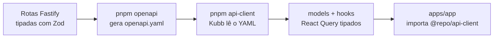

# Boilerplate Monorepo (SaaS)

[](https://github.com/rodrigocgodoy/boilerplate-monorepo/actions/workflows/ci.yml)


Ponto de partida enxuto para SaaS em TypeScript: autenticação pronta, contrato tipado de ponta a ponta gerado a partir do OpenAPI, banco com Prisma e UI com tokens fáceis de customizar.

O objetivo não é ser um framework, e sim eliminar a semana que se perde em todo projeto novo configurando as mesmas cinco coisas.

---

## O problema que este boilerplate resolve

Todo SaaS começa igual: configurar workspace, subir autenticação, definir o contrato entre API e frontend, montar o design system e decidir como o time vai rodar tudo localmente. Esse trabalho não diferencia produto nenhum, mas custa dias — e, quando é feito às pressas, vira dívida técnica antes do primeiro deploy.

O ponto central aqui é o **contrato tipado automático**. A API é a fonte da verdade: rotas tipadas com Zod geram o `openapi.yaml`, e o Kubb gera os hooks React Query a partir desse arquivo. O frontend não escreve client HTTP, não declara tipo de resposta e não descobre em produção que um campo mudou de nome. Se o contrato quebra, quebra no build.

---

## Decisões arquiteturais

Por que cada peça está aqui, e o que foi descartado no caminho.

| Decisão | Alternativas consideradas | Motivo |
|---|---|---|
| **Monorepo com Turborepo + pnpm workspaces** | Repositórios separados, Nx | Contrato entre API e frontend precisa viver no mesmo commit. Repositórios separados transformam mudança de campo em coordenação de dois pull requests. Turborepo entrega cache e pipeline sem o peso de configuração do Nx. |
| **Fastify** | Express, NestJS | Validação e serialização por schema nativas, integração direta com Zod via `fastify-type-provider-zod` e geração de OpenAPI sem camada extra. NestJS traz estrutura que só compensa em time grande. |
| **Contrato gerado (Zod → OpenAPI → Kubb)** | Client HTTP manual, tRPC | Client escrito à mão desatualiza silenciosamente. tRPC acopla frontend e backend ao mesmo runtime TypeScript, inviabilizando consumidores externos; OpenAPI mantém a API aberta a qualquer cliente. |
| **Better Auth** | Auth.js, Clerk, autenticação própria | Controle total do banco e das sessões, sem custo por usuário e sem dependência de serviço externo. Autenticação própria é o tipo de código que parece simples e envelhece mal. |
| **Prisma + adapter-pg** | Drizzle, SQL puro | Migrations e tipagem confiáveis com curva de entrada baixa para quem entra no projeto. O schema começa com o mínimo (modelos do Better Auth) para não impor modelagem de domínio. |
| **Biome** | ESLint + Prettier | Uma ferramenta, um arquivo de configuração e execução significativamente mais rápida no lugar de dois ecossistemas de plugins que conflitam entre si. |
| **shadcn/ui com tokens OKLCH** | Biblioteca de componentes pronta | Componentes ficam no repositório, não em `node_modules` — dá para editar sem lutar contra a API de terceiro. OKLCH mantém contraste perceptualmente consistente ao trocar a paleta. |
| **i18n desde o início** | Adicionar quando precisar | Internacionalizar depois significa varrer strings em toda a base. Nascer com três idiomas custa quase nada e evita a refatoração. |

> Ajuste esta tabela ao seu raciocínio real antes de publicar. Ela é o que transforma o repositório de setup em argumento — e é sobre ela que você vai ser perguntado.

---

## Stack

| Pacote | Responsabilidade |
|---|---|
| `apps/app` | Vite + React 19 + TanStack Router/Query (login + página autenticada) |
| `apps/api` | Fastify + Zod + Better Auth, gera `openapi.yaml` automaticamente |
| `packages/api-client` | Kubb gera hooks React Query a partir do `openapi.yaml` |
| `packages/database` | Prisma + adapter-pg (somente modelos do Better Auth) |
| `packages/ui` | Primitivos shadcn + tokens neutros em OKLCH |
| `packages/i18n` | Mensagens compartilhadas com chaves tipadas (pt-BR, en, es) |
| `packages/utils` | `auth-client` e resolução de URL da API |
| `packages/biome-config` | Configuração de lint e formatação compartilhada |
| `packages/typescript-config` | `tsconfig` base compartilhado |

---

## Arquitetura do contrato



Mudou ou adicionou rota? `pnpm openapi && pnpm api-client`. Qualquer divergência entre API e frontend passa a falhar em tempo de compilação, não em produção.

---

## Estrutura

```
.
├── apps
│   ├── api                 # Fastify + Zod + Better Auth
│   └── app                 # Vite + React 19 + TanStack
├── packages
│   ├── api-client          # hooks gerados pelo Kubb
│   ├── database            # Prisma + adapter-pg
│   ├── ui                  # shadcn + tokens OKLCH
│   ├── i18n                # pt-BR, en, es
│   ├── utils
│   ├── biome-config
│   └── typescript-config
├── .agents/skills          # instruções para agentes de IA
├── .claude/skills          # skills do Claude Code
├── .github/workflows       # CI
├── CLAUDE.md               # contexto do projeto para IA
├── docker-compose.yml      # Postgres local
└── turbo.json
```

---

## Pré-requisitos

- Node `>= 24.10` e pnpm `>= 10.32` (veja `.nvmrc`)
- Docker, para o Postgres local

## Bootstrap

```bash
cp .env.example .env          # ajuste os segredos
pnpm install
pnpm dep-up                   # sobe o Postgres
pnpm db:generate              # gera o Prisma Client
pnpm db:migrate               # cria as tabelas do Better Auth
pnpm openapi                  # gera apps/api/openapi.yaml
pnpm api-client               # Kubb gera os hooks tipados
pnpm dev                      # api em :3333, app em :5173
```

Acesse `http://localhost:5173` — você é redirecionado para `/login`. Crie uma conta com e-mail e senha e caia no `/dashboard`, que consome o hook `useGetMe()`.

Documentação da API (Scalar) em `http://localhost:3333/reference`, em modo de desenvolvimento.

## Scripts

| Comando | O que faz |
|---|---|
| `pnpm dev` | Sobe API e app em paralelo |
| `pnpm dep-up` | Sobe as dependências de infraestrutura via Docker |
| `pnpm db:generate` | Gera o Prisma Client |
| `pnpm db:migrate` | Aplica as migrations |
| `pnpm openapi` | Sobe o Fastify em memória e escreve o `openapi.yaml` |
| `pnpm api-client` | Roda o Kubb e regenera models e hooks |

---

## Customização

- **Cores e tokens:** `packages/ui/src/styles/globals.css` — variáveis `--*` em `:root` e `.dark`
- **Autenticação:** `apps/api/src/modules/better-auth/configs.ts`
- **Redis, MinIO/S3, e-mail e outros:** veja [`UPGRADES.md`](./UPGRADES.md)
- **Traduções:** `packages/i18n`

## Internacionalização

Idiomas: **pt-BR** (padrão), **en** e **es**. As mensagens ficam em `@repo/i18n` (`packages/i18n/src/locales/*.ts`), agrupadas por namespace (`common`, `auth`, `validation`, `dashboard`) com chaves tipadas.

**Frontend** (`apps/app`): react-i18next inicializado em `src/i18n.ts`, com detecção via `localStorage` e fallback para o navegador, preferência persistida. Use `useTranslation([ns...])` e `t('ns:chave')`. Há um `LanguageSwitcher` no login e no dashboard.

**API** (`apps/api`): idioma resolvido por requisição através do header `Accept-Language` (`src/utils/i18n.ts` mais hook em `plugin.ts`), expondo `request.t` e respondendo com `Content-Language`. O 401 de `GET /me`, por exemplo, já vem traduzido.

**Adicionar idioma:** copie `packages/i18n/src/locales/pt-BR.ts`, traduza e registre em `config.ts` (`locales`) e em `resources.ts`.
**Nova chave:** adicione em `pt-BR.ts`, que é a referência de tipos, e replique nos demais.

---

## Desenvolvimento assistido por IA

O repositório já vem configurado para trabalho com agentes de código:

- `CLAUDE.md` — contexto do projeto, convenções e restrições que o agente deve respeitar
- `.claude/skills` e `.agents/skills` — instruções reutilizáveis para tarefas recorrentes
- `.mcp.json` — servidores MCP disponíveis no projeto

A ideia é que o agente conheça as convenções do monorepo antes da primeira instrução, em vez de precisar receber o contexto a cada sessão.

---

## Documentação relacionada

- [`ROADMAP.md`](./ROADMAP.md) — o que ainda está previsto
- [`TESTING.md`](./TESTING.md) — estratégia e execução de testes
- [`UPGRADES.md`](./UPGRADES.md) — como adicionar Redis, storage, e-mail e outros serviços

## Licença

MIT — veja [`LICENSE`](./LICENSE).
